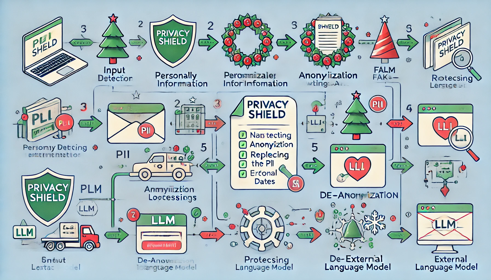
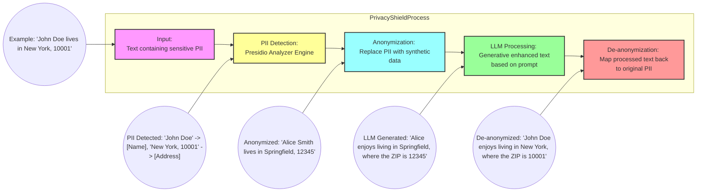
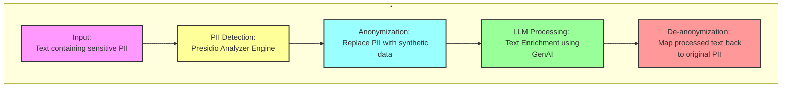

# Privacyshield

Secure text processing with LLMs, protecting PII using Presidio and LangChain.

---

## Privacy Engineering with LLMs: Safeguarding PII While Enhancing Text with Privacy Shield




# Introduction

In today’s data-driven environment, the use of Large Language Models (LLMs) for generative AI and text processing is not just important but increasingly common. With tools like ChatGPT, Google Gemini, Claude.ai, Perplexity and open-source AI models like Llama, Mistral.ai  etc. people now rely on LLMs for tasks ranging from email proofreading to refining documents like legal contracts and research papers. However, this widespread adoption also brings a critical challenge: ***How do we protect Personally Identifiable Information (PII) within these workflows?***

Privacy Shield is an open-source utility I created to address the increasing need for protecting Personally Identifiable Information (PII) when working with Large Language Models (LLMs). It builds directly on the code developed by [LangChain](https://python.langchain.com/v0.1/docs/guides/productionization/safety/presidio_data_anonymization/reversible/) and Microsoft Presidio, which has been ported as a Python API and designed to be consumed as an API or microservice by frontend applications. It provides a structured approach to anonymize sensitive data, enhance text, and enable reversible de-anonymization, ensuring that sensitive information remains secure throughout the processing workflow.

In this article, I explore the core technology, implementation details, and benefits of incorporating Privacy Shield into workflows that handle sensitive data, along with practical guidance and real-world examples.

## Use Case Scenario: Protecting Sensitive Data

Consider a scenario where a company is processing legal documents or customer logs that contain PII. The goal is to use LLMs to refine the text, improve clarity, or extract insights. However, directly exposing sensitive data to external services poses a privacy risk.

With **Privacy Shield**, the organization can:

- Replace PII with realistic synthetic data.
- Use LLMs to enhance text.
- Restore the original PII after processing.

This ensures compliance with privacy regulations and eliminates the risk of data leaks.



## Ingredients / Technology Stack

Privacy Shield combines several modern technologies to deliver a seamless and secure text-processing workflow:

*   **[Presidio](https://microsoft.github.io/presidio/)**: An open-source library for **detecting and anonymizing PII**, supporting over 100 PII types.

*   **[LangChain](https://www.langchain.com/)**: A framework for building **LLM-powered applications**, used here for reversible anonymization and LLM integration.

*   **[OpenAI](https://openai.com/) or [Ollama API](https://ollama.com/)**: Provides access to powerful **LLMs like GPT-3.5-turbo or Llama3.2** for text processing.

*   **Python**: The core programming language for the project's **backend logic and component integration.**

*   **[FastAPI](https://fastapi.tiangolo.com/)**: A high-performance web framework for building the **REST API**.


## Technical Design / Schematic Flow

The Privacy Shield process follows a carefully structured pipeline to ensure data security:

1. **Input**: The workflow begins with text containing sensitive PII.
2. **PII Detection**: The Presidio Analyzer Engine scans the text to identify and categorize PII types (e.g., names, dates, and addresses).
3. **Anonymization**: Detected PII is replaced with synthetic data (e.g., fake names and addresses) using Presidio Anonymizer and Faker.
4. **LLM Processing**: The anonymized text is sent to an external LLM for processing tasks like grammar correction or summarization.
5. **De-anonymization**: Processed text is mapped back to its original PII using reversible anonymization.
6. **Output**: The final result is enhanced text, restored with original PII, ensuring data privacy throughout.




## Benefits of Privacy Shield

- **PII Protection**: Keeps sensitive information secure by never exposing it to external services.
- **Data Privacy**: Uses robust anonymization and de-anonymization techniques.
- **Safe Processing**: Allows for powerful text enhancement without risking data breaches.
- **Flexibility**: Supports customization with parameters like `faker_seed`, `prompt_template`, and `temperature`.
- **Scalability**: Stateless architecture ensures seamless scalability for large datasets.
- **Comprehensive Logging**: Enables detailed monitoring for auditability.


## Getting Started

### 1. Clone the Repository
Clone the Privacy Shield repository and navigate to the project directory:
```bash
git clone https://github.com/senthilsweb/privacyshield.git
cd privacyshield
```

### 2. Set Up the Environment

#### Step 1: Create and Activate Virtual Environment
Use Python 3.10:
```bash
python3.10 -m venv env
source env/bin/activate
```

#### Step 2: Install Dependencies
Upgrade pip and install required packages:
```bash
pip install --upgrade pip
pip install fastapi uvicorn langchain langchain-experimental langchain-openai \
presidio-analyzer presidio-anonymizer spacy pydantic python-dotenv faker requests
```

Or install dependencies from the `requirements.txt` file:
```bash
pip install -r requirements.txt
```

#### Step 3: Download SpaCy Model

```bash
python -m spacy download en_core_web_lg
```

#### Step 4: Create `.env` from `sample.env`


```bash
OPENAI_API_KEY=your_key_here
DEFAULT_TEMPERATURE=0
#DEFAULT_PROMPT_TEMPLATE="Rewrite this text into an official, short email:\n\n{anonymized_text}"
DEFAULT_PROMPT_TEMPLATE="Rewrite this text into an ServiceNow Incident Ticket:\n\n{anonymized_text}"
LOG_LEVEL=INFO
DEFAULT_MODEL="gpt-3.5-turbo"
```

| :exclamation:  The placeholder `{anonymized_text}` name cannot be modified.   |
|----------------------------------------------|

#### Step 6: Run the API Server

```bash
python3.10 main.py
```

or run it in different port

```bash
uvicorn main:app --host 0.0.0.0 --port 8001
```

#### Step 4: Access the API `http://localhost:8000`

---


## Privacy Shield API Documentation


### 1. Detect PII Entities

**Endpoint**: `/detect-pii-entities`  
**Method**: `POST`  
**Description**: Detects PII entities in the text and replaces them with placeholders.

#### Request Body Example
```json
{
  "text": "Maria Lynch recently lost his wallet. Inside is some cash and his credit card with the number 4838637940262. If you would find it, please call at 7344131647 or write an email here: jamesmichael@example.com. Maria Lynch would be very grateful!",
  "temperature": 0.2
}
```

#### Response Example
```json
{
    "processed_text": "<PERSON> recently lost his wallet. Inside is some cash and his credit card with the number <CREDIT_CARD>. If you would find it, please call at <DATE_TIME> or write an email here: <EMAIL_ADDRESS>. <PERSON> would be very grateful!",
    "entities": [
        {
            "type": "PERSON",
            "score": 0.85,
            "start": 0,
            "end": 11,
            "text": "Maria Lynch"
        },
        {
            "type": "CREDIT_CARD",
            "score": 1.0,
            "start": 94,
            "end": 107,
            "text": "4838637940262"
        },
        {
            "type": "US_BANK_NUMBER",
            "score": 0.05,
            "start": 94,
            "end": 107,
            "text": "4838637940262"
        },
        {
            "type": "US_DRIVER_LICENSE",
            "score": 0.01,
            "start": 94,
            "end": 107,
            "text": "4838637940262"
        },
        {
            "type": "DATE_TIME",
            "score": 0.85,
            "start": 146,
            "end": 156,
            "text": "7344131647"
        },
        {
            "type": "PHONE_NUMBER",
            "score": 0.75,
            "start": 146,
            "end": 156,
            "text": "7344131647"
        },
        {
            "type": "IN_PAN",
            "score": 0.05,
            "start": 146,
            "end": 156,
            "text": "7344131647"
        },
        {
            "type": "US_BANK_NUMBER",
            "score": 0.05,
            "start": 146,
            "end": 156,
            "text": "7344131647"
        },
        {
            "type": "US_DRIVER_LICENSE",
            "score": 0.01,
            "start": 146,
            "end": 156,
            "text": "7344131647"
        },
        {
            "type": "EMAIL_ADDRESS",
            "score": 1.0,
            "start": 181,
            "end": 205,
            "text": "jamesmichael@example.com"
        },
        {
            "type": "URL",
            "score": 0.5,
            "start": 194,
            "end": 205,
            "text": "example.com"
        },
        {
            "type": "PERSON",
            "score": 0.85,
            "start": 207,
            "end": 218,
            "text": "Maria Lynch"
        }
    ],
    "message": "PII entities detected successfully"
}
```

---

### 2. Anonymize and Transform

**Endpoint**: `/anonymize-and-transform`  
**Method**: `POST`  
**Description**: Anonymizes PII and generates transformed text using an LLM.

#### Request Body Example
```json
{
  "text": "Maria Lynch recently lost his wallet. Inside is some cash and his credit card with the number 4838637940262. If you would find it, please call at 7344131647 or write an email here: jamesmichael@example.com. Maria Lynch would be very grateful!",
  "temperature": 0.2
}
```

#### Response Example

``` json
{
    "original_text": "Maria Lynch recently lost his wallet. Inside is some cash and his credit card with the number 4838637940262. If you would find it, please call at 7344131647 or write an email here: jamesmichael@example.com. Maria Lynch would be very grateful!",
    "anonymized_text": "<PERSON> recently lost his wallet. Inside is some cash and his credit card with the number <CREDIT_CARD>. If you would find it, please call at <DATE_TIME> or write an email here: <EMAIL_ADDRESS>. <PERSON> would be very grateful!",
    "faked_text": "Jeffrey Curry recently lost his wallet. Inside is some cash and his credit card with the number 4079577328073. If you would find it, please call at 1974-01-25 or write an email here: rodriguezanna@example.org. Jeffrey Curry would be very grateful!",
    "faked_processed_text": "\n\nIf you have found Jeffrey Curry's wallet, please contact him at the provided phone number or email address. Thank you for your help in returning his belongings.",
    "processed_text": "\n\nIf you have found Maria Lynch's wallet, please contact him at the provided phone number or email address. Thank you for your help in returning his belongings.",
    "model_used": "gpt-3.5-turbo",
    "temperature_used": 0.2,
    "prompt_used": "\n\n{anonymized_text}",
    "entities": [
        {
            "type": "PERSON",
            "score": 0.85,
            "start": 0,
            "end": 11,
            "text": "Maria Lynch"
        },
        {
            "type": "CREDIT_CARD",
            "score": 1.0,
            "start": 94,
            "end": 107,
            "text": "4838637940262"
        },
        {
            "type": "US_BANK_NUMBER",
            "score": 0.05,
            "start": 94,
            "end": 107,
            "text": "4838637940262"
        },
        {
            "type": "US_DRIVER_LICENSE",
            "score": 0.01,
            "start": 94,
            "end": 107,
            "text": "4838637940262"
        },
        {
            "type": "DATE_TIME",
            "score": 0.85,
            "start": 146,
            "end": 156,
            "text": "7344131647"
        },
        {
            "type": "PHONE_NUMBER",
            "score": 0.75,
            "start": 146,
            "end": 156,
            "text": "7344131647"
        },
        {
            "type": "IN_PAN",
            "score": 0.05,
            "start": 146,
            "end": 156,
            "text": "7344131647"
        },
        {
            "type": "US_BANK_NUMBER",
            "score": 0.05,
            "start": 146,
            "end": 156,
            "text": "7344131647"
        },
        {
            "type": "US_DRIVER_LICENSE",
            "score": 0.01,
            "start": 146,
            "end": 156,
            "text": "7344131647"
        },
        {
            "type": "EMAIL_ADDRESS",
            "score": 1.0,
            "start": 181,
            "end": 205,
            "text": "jamesmichael@example.com"
        },
        {
            "type": "URL",
            "score": 0.5,
            "start": 194,
            "end": 205,
            "text": "example.com"
        },
        {
            "type": "PERSON",
            "score": 0.85,
            "start": 207,
            "end": 218,
            "text": "Maria Lynch"
        }
    ],
    "message": "Enhanced text processed successfully"
}
```


### 2. anonymize-with-fake-data

**Endpoint**: `/anonymize-with-fake-data` 
**Method**: `POST`  
**Description**: Detect PII entities and reaplce it with fake data

#### Request Body Example
```json
{
  "text": "Maria Lynch recently lost his wallet. Inside is some cash and his credit card with the number 4838637940262. If you would find it, please call at 7344131647 or write an email here: jamesmichael@example.com. Maria Lynch would be very grateful!",
  "temperature": 0.2
}
```

#### Response Example

``` json
{
    "processed_text": "Jeffrey Curry recently lost his wallet. Inside is some cash and his credit card with the number 4079577328073. If you would find it, please call at 1974-01-25 or write an email here: rodriguezanna@example.org. Jeffrey Curry would be very grateful!",
    "entities": [
        {
            "type": "PERSON",
            "score": 0.85,
            "start": 0,
            "end": 11,
            "text": "Maria Lynch"
        },
        {
            "type": "CREDIT_CARD",
            "score": 1.0,
            "start": 94,
            "end": 107,
            "text": "4838637940262"
        },
        {
            "type": "US_BANK_NUMBER",
            "score": 0.05,
            "start": 94,
            "end": 107,
            "text": "4838637940262"
        },
        {
            "type": "US_DRIVER_LICENSE",
            "score": 0.01,
            "start": 94,
            "end": 107,
            "text": "4838637940262"
        },
        {
            "type": "DATE_TIME",
            "score": 0.85,
            "start": 146,
            "end": 156,
            "text": "7344131647"
        },
        {
            "type": "PHONE_NUMBER",
            "score": 0.75,
            "start": 146,
            "end": 156,
            "text": "7344131647"
        },
        {
            "type": "IN_PAN",
            "score": 0.05,
            "start": 146,
            "end": 156,
            "text": "7344131647"
        },
        {
            "type": "US_BANK_NUMBER",
            "score": 0.05,
            "start": 146,
            "end": 156,
            "text": "7344131647"
        },
        {
            "type": "US_DRIVER_LICENSE",
            "score": 0.01,
            "start": 146,
            "end": 156,
            "text": "7344131647"
        },
        {
            "type": "EMAIL_ADDRESS",
            "score": 1.0,
            "start": 181,
            "end": 205,
            "text": "jamesmichael@example.com"
        },
        {
            "type": "URL",
            "score": 0.5,
            "start": 194,
            "end": 205,
            "text": "example.com"
        },
        {
            "type": "PERSON",
            "score": 0.85,
            "start": 207,
            "end": 218,
            "text": "Maria Lynch"
        }
    ],
    "message": "Anonymized with fake data: text processed successfully."
}
```

