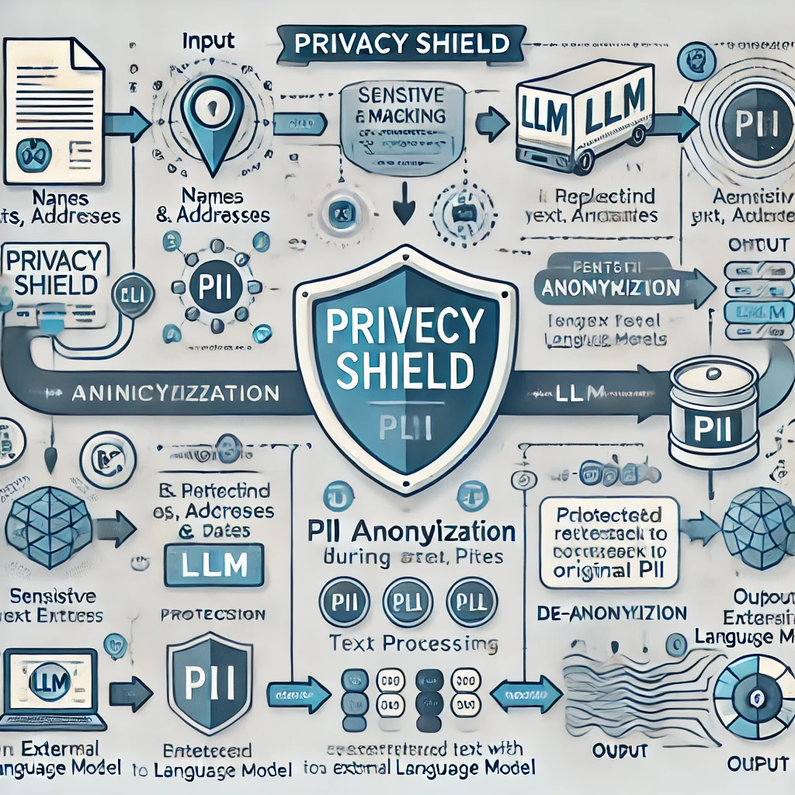
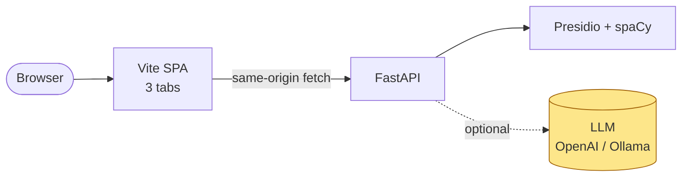

# Privacy Shield

> Detect, anonymize, and safely enhance text containing PII — locally, without sending sensitive data to anyone.



Privacy Shield is a single-container web app combining:

- **FastAPI** + **Microsoft Presidio** + **spaCy** for PII detection & anonymization
- A clean **Vite + React + Tailwind** SPA for three workflows:
  - **Detect** — find PII spans, types, and confidence scores
  - **Anonymize** — replace PII with realistic synthetic data
  - **Enhance & reverse-anonymize** — anonymize → call an LLM → restore original PII

Everything runs on your machine. The only outbound call is to your chosen LLM endpoint (and only if you use the Enhance tab).

## Quick start (Docker)

```bash
docker run --rm -p 8000:8000 ghcr.io/senthilsweb/privacyshield:latest
# open http://localhost:8000
```

Or with compose (recommended for env management):

```bash
curl -L https://raw.githubusercontent.com/senthilsweb/privacyshield/main/docker-compose.yaml -o docker-compose.yaml
docker compose up -d
```

## API

| Method | Path                          | Purpose                                    |
| ------ | ----------------------------- | ------------------------------------------ |
| GET    | `/health`                     | Liveness probe (`{"status":"ok"}`)         |
| POST   | `/detect-pii-entities`        | Detect spans, types, scores                |
| POST   | `/anonymize-with-fake-data`   | Replace PII with realistic fake values     |
| POST   | `/anonymize-and-transform`    | Anonymize → LLM → reverse-anonymize        |
| POST   | `/convert` *(opt-in)*         | Reserved for [Markitdown](https://github.com/microsoft/markitdown); set `ENABLE_CONVERT=true` |

Interactive Swagger UI is auto-published at `/docs`.

## Configuration

| Env var           | Default   | Notes                                                  |
| ----------------- | --------- | ------------------------------------------------------ |
| `OPENAI_API_KEY`  | *(unset)* | Required only for the Enhance tab with OpenAI models   |
| `CORS_ORIGINS`    | `*`       | Comma-separated origins                                |
| `ENABLE_CONVERT`  | `false`   | Mount the `/convert` placeholder route                 |
| `LOG_LEVEL`       | `INFO`    | `DEBUG` for verbose logs                               |
| `PORT`            | `8000`    | HTTP listen port                                       |

## Architecture


```mermaid
flowchart LR
  user([Browser]) --> spa[Vite SPA<br/>3 tabs]
  spa -->|same-origin fetch| api[FastAPI]
  api --> presidio[Presidio + spaCy]
  api -. optional .-> llm[(LLM<br/>OpenAI / Ollama)]
  classDef ext fill:#fde68a,stroke:#a16207
  class llm ext
```

See [docs/architecture.md](docs/architecture.md) for the full design and [docs/about.md](docs/about.md) for the project background.

## Development

<details>
<summary>Run locally without Docker</summary>

```bash
# Backend (FastAPI on :8001)
cd backend
python3.10 -m venv env && source env/bin/activate
pip install -r requirements.txt && pip install "uvicorn[standard]"
python -m spacy download en_core_web_lg
uvicorn api:app --reload --port 8001

# Frontend (Vite on :3000, proxies API to :8001)
cd ../frontend
npm install
npm run dev
```

Open `http://localhost:3000`.
</details>

## License

[MIT](LICENSE) © Senthilnathan Karuppaiah
