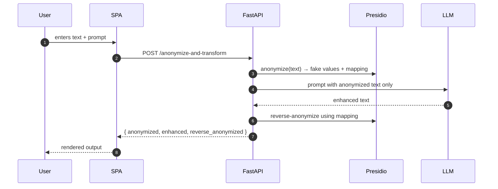
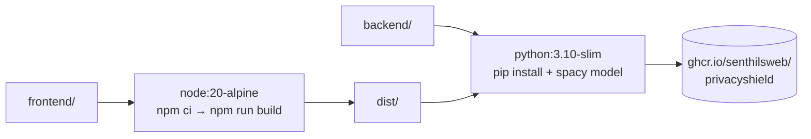

# Architecture

Privacy Shield ships as a single Docker image that bundles the FastAPI backend and the compiled Vite SPA together. There is no separate frontend service — the SPA is served as static assets by FastAPI on the same origin as the API, so no CORS preflights and no second port.

## Components

| Layer        | Tech                                               | Purpose                                                        |
| ------------ | -------------------------------------------------- | -------------------------------------------------------------- |
| UI           | Vite 5 + React 18 + Tailwind v3 + Radix + Iconify  | Three-tab workflow (Detect / Anonymize / Enhance)              |
| API          | FastAPI on Uvicorn                                 | REST endpoints (`/detect-…`, `/anonymize-…`, `/health`, `/docs`) |
| PII engine   | Microsoft Presidio Analyzer + Anonymizer           | Detect & substitute PII with placeholders or fake values        |
| NLP model    | spaCy `en_core_web_lg`                             | Named-entity recognition powering Presidio                      |
| LLM (opt-in) | OpenAI-compatible HTTP API (OpenAI, Ollama, etc.)  | Used only by the Enhance tab; configurable per-request          |

## Request lifecycle (Enhance tab)

The original PII never leaves the FastAPI process. The LLM only ever sees the anonymized form.

## Image build

A multi-arch build (`linux/amd64`, `linux/arm64`) is published by the GitHub Actions workflow on every push to `main` and on each `v*` tag.

## Why this layout

- **One container, one port** — easier to deploy on any PaaS, K8s pod, or behind a reverse proxy.
- **Same-origin SPA** — eliminates CORS in production while still allowing flexible CORS in dev.
- **Stateless** — no database, no sessions; horizontally scalable behind a load balancer if needed.
- **No outbound calls by default** — only the optional Enhance tab calls an LLM, and the user supplies the endpoint and key.
